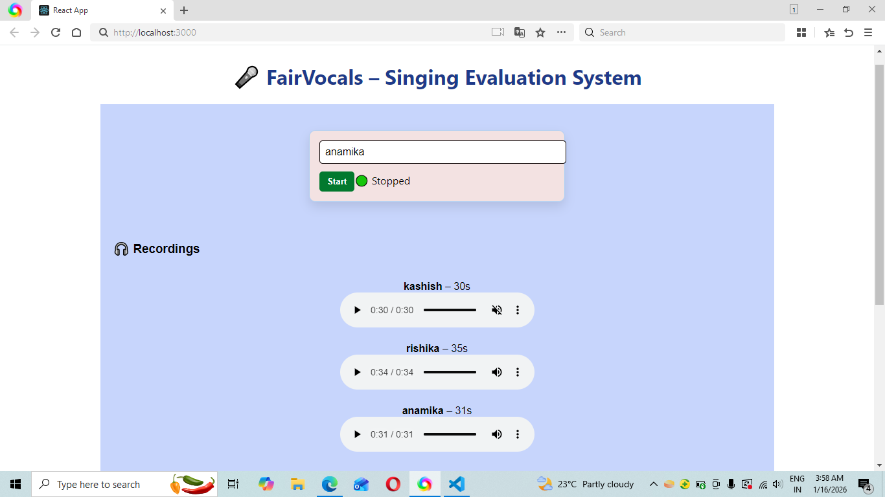
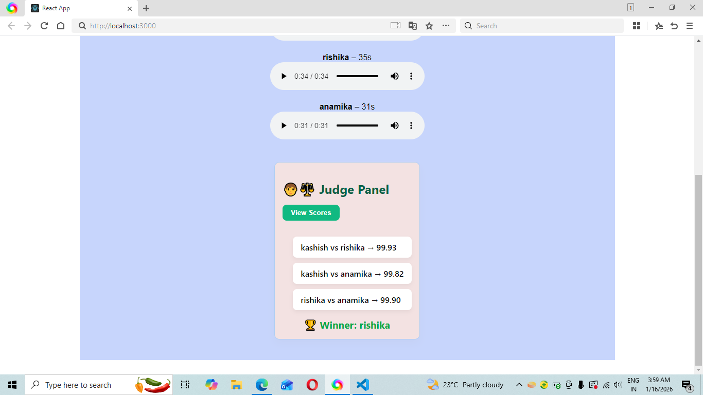

# 🎤 FairVocals – Singing Evaluation System

FairVocals is a web application that allows users to record singers, preview their recordings, and automatically evaluate performances based on voice features (MFCC) using a backend Python server. The system compares multiple singers and determines the winner based on voice similarity, pitch, clarity, and other features.

---

## 🖥 Features

- Record singers directly from the browser (no external software needed).  
- Preview recordings with name and duration.  
- Compare singers using MFCC features for accurate voice similarity.  
- Automatically calculate scores and determine the winner.  
- Clean and responsive UI with a judge panel for evaluation.  
- Saves all recordings to the backend `uploads/` folder.  

---

### Home Page

### 


## 🛠 Tech Stack

**Frontend:**  
- React.js  
- Axios  
- CSS for styling  

**Backend:**  
- Python Flask  
- Pydub (for audio processing)  
- Numpy & Scipy (for feature extraction)  
- FFmpeg (audio conversion and handling)  

---

## 📁 Project Structure

# 🎤 FairVocals – Singing Evaluation System

FairVocals is a web application that allows users to record singers, preview their recordings, and automatically evaluate performances based on voice features (MFCC) using a backend Python server. The system compares multiple singers and determines the winner based on voice similarity, pitch, clarity, and other features.

---

## 🖥 Features

- Record singers directly from the browser (no external software needed).  
- Preview recordings with name and duration.  
- Compare singers using MFCC features for accurate voice similarity.  
- Automatically calculate scores and determine the winner.  
- Clean and responsive UI with a judge panel for evaluation.  
- Saves all recordings to the backend `uploads/` folder.  

---

## 🛠 Tech Stack

**Frontend:**  
- React.js  
- Axios  
- CSS for styling  

**Backend:**  
- Python Flask  
- Pydub (for audio processing)  
- Numpy & Scipy (for feature extraction)  
- FFmpeg (audio conversion and handling)  

---

## 📁 Project Structure

fairvocals/

│
├─ fairvocals-client/ # React frontend

│ ├─ src/

│ │ ├─ App.js

│ │ ├─ components/

│ │ │ ├─ Recorder.js

│ │ │ └─ JudgePanel.js

│ │ └─ index.js

│ └─ package.json

│
├─ server/ # Flask backend

│ ├─ app.py

│ ├─ requirements.txt

│ └─ uploads/ # Recordings are stored here

│
└─ README.md


---

## ⚡ Installation

### Backend

1. Create a virtual environment and activate it:

python -m venv venv
# Windows
venv\Scripts\activate
# macOS/Linux
source venv/bin/activate

2. Install required packages:

pip install -r server/requirements.txt

3. Make sure FFmpeg is installed and added to PATH. You can test by:

ffmpeg -version

4. Start the backend server:

python server/app.py

### Frontend

1. Navigate to the frontend folder:

cd fairvocals-client

2. Install dependencies:

npm install --legacy-peer-deps


3. Start the development server:

npm start

4. Open your browser at:

http://localhost:3000

### 🎶 How to Use

1. Enter the singer's name.
2. Click Start Recording to begin, Stop to end.
3. Recording will appear below with a preview and duration.
4. Repeat for multiple singers.
5. Click View Scores in the Judge Panel to see comparisons.
6. Winner is displayed automatically based on voice similarity.

### 📦 Notes
1. Ensure at least 2 singers are recorded for proper comparison.
2. Recordings are saved as .wav or .webm in the uploads/ folder.
3. MFCC-based scoring ensures that the evaluation is based on voice features, not just duration.

### 🔧 Dependencies

Frontend:

"dependencies": {
  "react": "^19.2.3",
  "react-dom": "^19.2.3",
  "axios": "^1.7.2"
}


Backend:

Flask
numpy
scipy
pydub

### 👨‍💻 Author

### Kashish Malviya – MCA Student | FairVocals Project
``` bash
